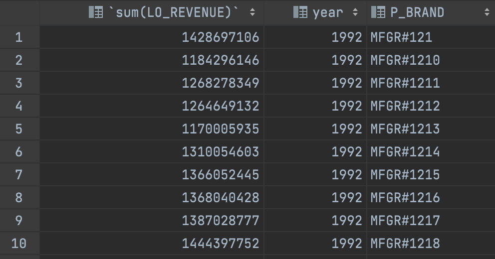
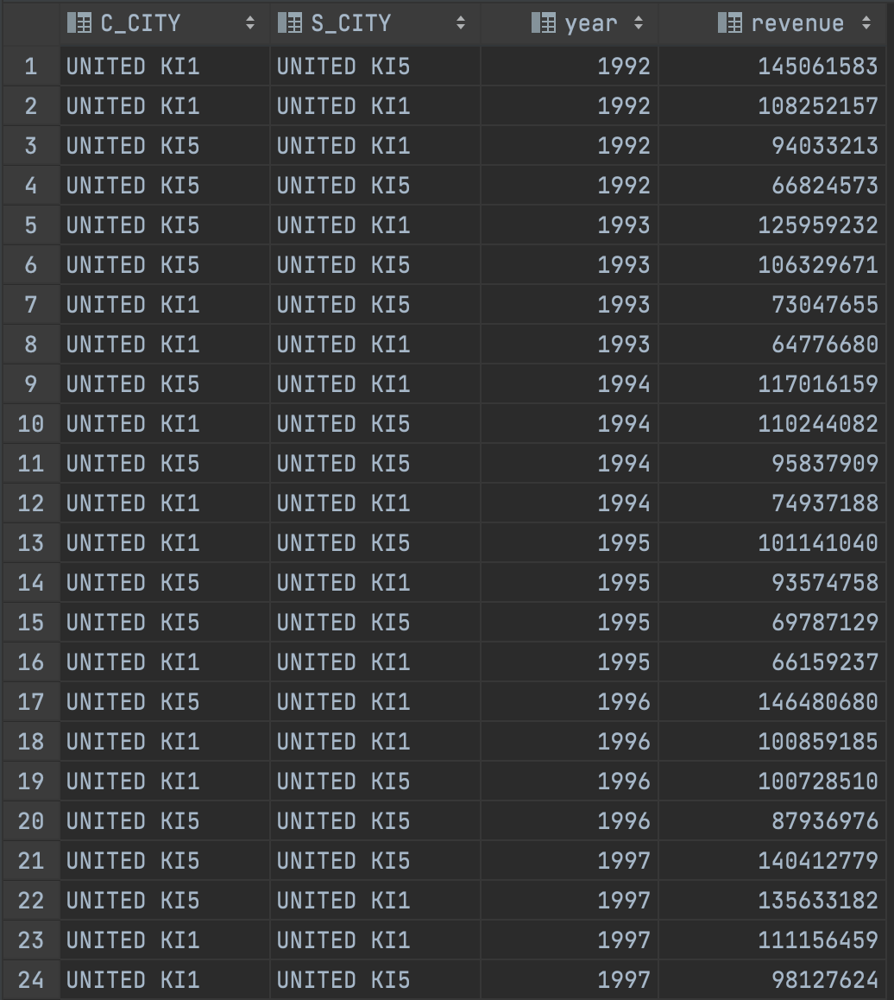
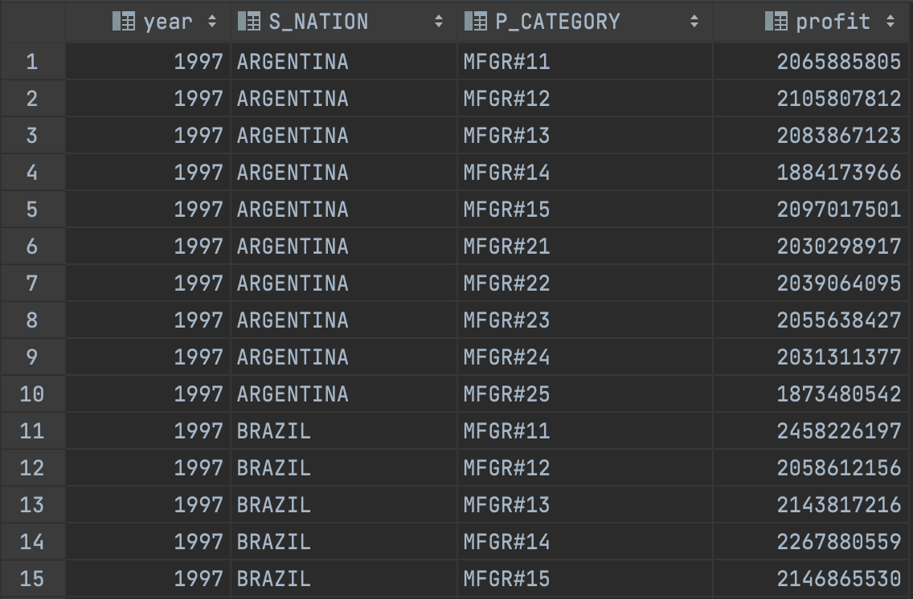

### 1. Deploy Clickhouse

```bash
echo "Deploy Clickhouse"
read -s pswrd

yc managed-clickhouse cluster create \
	--name otus-clickhouse- \
	--shard-name shard1 \
	--environment production \
	--network-name my-yc-network \
	--host type=clickhouse,zone-id=ru-central1-b,subnet-name=my-yc-subnet-b \
	--clickhouse-resource-preset s2.small \
	--clickhouse-disk-size 20 \
	--clickhouse-disk-type network-ssd \
	--database name=db1 \
	--datalens-access \
	--version 22.5 \
	--enable-sql-user-management \
	--service-account aje3sljsuve3ic95f6fd \
	--admin-password "$pswrd" 
```

### 2. Init dbt project

```bash
dbt init clickhouse_starschema
```

### 3. Install environment – dbt + clickhouse dependency

[Pipfile](Pipfile)

```txt
[packages]
dbt-core = "==1.0.4"
dbt-clickhouse = "==1.0.4"

[requires]
python_version = "3.9"
```

### 4. Configure project (dbt_project)

dbt_project.yml
```yml
require-dbt-version: ">=1.0.0"
```
packages.yml
```yml
packages:
  - package: dbt-labs/codegen
    version: 0.6.0 
  - package: dbt-labs/dbt_utils
    version: 0.8.5 
```

### 5. Configure connection (profile)

profiles.yml
```yml
clickhouse_starschema:
  target: dev
  outputs:
    dev:
      type: clickhouse
      schema: db1
      host: c-<ID>.rw.mdb.yandexcloud.net
      port: 9440
      user: <user>
      password: <password>
      secure: True
```

### 6. Prepare source data files (S3)

```bash
ssh yc-user@<host>

git clone https://github.com/vadimtk/ssb-dbgen.git
cd ssb-dbgen
sudo apt install gcc
sudo make
./dbgen -s 2 -T a
ls -lh | grep .tbl

sudo apt install awscli
aws configure
aws --endpoint-url=https://storage.yandexcloud.net s3 ls
aws --endpoint-url=https://storage.yandexcloud.net s3 sync . s3://ssb-dbgen/ --exclude=* --include=*.tbl --acl=public-read 
aws --endpoint-url=https://storage.yandexcloud.net s3 ls
aws --endpoint-url=https://storage.yandexcloud.net s3 ls ssb-dbgen
```

### 7. Configure EXTERNAL TABLES (S3)

[init_s3_sources](macros/init_s3_sources.sql)

> I've used var to define custom schema in macro:

dbt_project.yml
```yml
vars:
  schema: 'db1'
```

### 8. Describe sources in .yml files

[sources](sources/sources.yml)

### 9. Basic dbt models and configurations

[models](models)

> I've used `dbt run-operation generate_model_yaml --args '{"model_name": "customers"}'` to generate .yml files. Also prepared [additional model](models/marts/pivoted.sql) using [dbt-utils pivot macro](https://github.com/dbt-labs/dbt-utils#pivot-source).

### 9. Code compilation + debugging

```bash
dbt compile
dbt debug
```
### 10. Prepare STAR schema

[lineorder_flat](models/lineorder_flat.sql)

> I've used [additional macro](macros/surrogate_key.sql) based on [dbt-utils surrogate_key one](https://github.com/dbt-labs/dbt-utils#surrogate_key-source) to generate surrogate and hash keys.

### 11. Querying results

Q2.1


Q3.3


Q4.2


### 12. Testing & Documenting your project

```bash
dbt test
dbt docs generate
```

Added `dbt_utils.unique_combination_of_columns` test for `(LO_ORDERKEY, LO_LINENUMBER)` combination.
